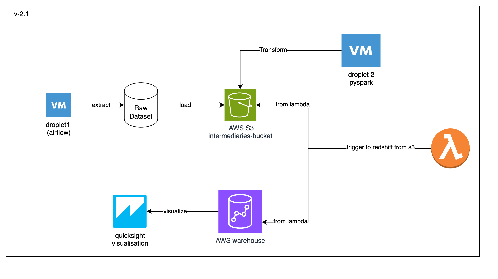

# Music Data Warehouse Project

## Introduction

This project have a learning purposes to create a scalable Music Data Warehouse using historical Spotify data from the dataset available on [Kaggle](https://raw.githubusercontent.com/rfordatascience/tidytuesday/master/data/2020/2020-01-21/spotify_songs.csv).  

## Video and Slides

[Video](https://youtu.be/h9fawCS2Jkk) and [Slide](https://docs.google.com/presentation/d/11XD12SjPKmb7PtSyQgYubaN6qyVMGuH0PQrE-Ro1QIU/edit?usp=sharing) can be seen in by clicking respective links. 

## Project Location
1. airflow/ -> Dag that running in droplet-1 for extracting raw_csv (running using docker-compose)
2. transform_raw_data/ -> pyspark analysis that running in droplet 2 for first extracting from S3 and transform data to redshift-table-1
3. transform_exising_data/ -> other analysis dataset using pandas(since the transformation on redshift-table-1 still have some issue) that running in droplet 2 and  stored in redshift table-2
4. metabase/ -> docker compose for running metabase on droplet-2
5. basic_songs_recomendations/ -> song recomendations using annoy library
6. redshift_query -> query that used on redshift console
7. install_docker.sh -> script for installing docker + docker compose on droplet 1 and droplet 2

## Why This Project is Needed

1. **Centralized Data Repository**: Consolidates scattered data for easier access and analysis.
2. **Enhanced Data Quality**: Ensures clean, standardized data through ETL processes.
3. **Scalable Processing**: Handles large data volumes efficiently using Apache Spark and AWS.
4. **Advanced Analytics**: Supports in-depth analysis and trend identification.

## Project Objectives

1. **Centralize Data**: Consolidate Spotify music data into a single data warehouse.
2. **Efficient ETL**: Develop a robust ETL pipeline for data extraction, transformation, and loading.
3. **Enable Analytics**: Provide tools for advanced analytics and reporting.

## Expected Outputs

1. **Data Warehouse**: A Redshift data warehouse with cleaned and transformed Spotify data.
2. **ETL Pipeline**: An automated pipeline using Airflow, Spark, S3, and Lambda.
3. **Dashboards and Reports**: Interactive analytics using Metabase, Superset, or Tableau.

## Dataset Description

The Spotify dataset includes metadata for 30,000 songs with the following features:

1. **track_id**: Unique song identifier
2. **track_name**: Song name
3. **track_artist**: Artist name
4. **track_popularity**: Popularity score (0-100)
5. **track_album_id**: Album identifier
6. **track_album_name**: Album name
7. **track_album_release_date**: Album release date
8. **playlist_name**: Playlist name
9. **playlist_id**: Playlist identifier
10. **playlist_genre**: Playlist genre
11. **playlist_subgenre**: Playlist subgenre
12. **danceability**: Danceability score (0.0-1.0)
13. **energy**: Energy score (0.0-1.0)
14. **key**: Key of the track (0-11, -1 if no key)
15. **loudness**: Loudness in dB
16. **mode**: Modality (0 = minor, 1 = major)
17. **speechiness**: Speechiness score (0.0-1.0)
18. **acousticness**: Acousticness score (0.0-1.0)
19. **instrumentalness**: Instrumentalness score (0.0-1.0)
20. **liveness**: Liveness score (0.0-1.0)
21. **valence**: Positiveness score (0.0-1.0)
22. **tempo**: Tempo in BPM
23. **duration_ms**: Duration in milliseconds

## Steps

1. **Data Extraction**: Extract raw data from kaggle and store it in S3.
2. **Data Transformation**: Clean and transform data using Spark.
3. **Data Loading**: Load transformed data from S3 into Redshift using AWS Lambda.
5. **Analytics and Reporting**: Create interactive dashboard using AWS Quicksight

## Technology Stack 
* **Apache Airflow**: Orchestrates the Extract workflow.
* **Apache Spark**: Performs data transformation tasks.
* **Amazon S3**: Intermediate storage for extracted and transformed data.
* **AWS Lambda**: Loads data from S3 into Redshift.
* **Amazon Redshift**: Data warehouse for storing processed data.
* **Amazon Quicksight**: Visualization tools for creating dashboards and reports.
